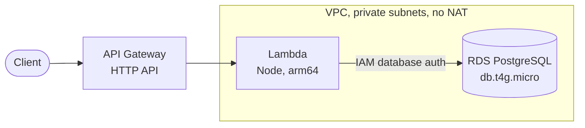

# CarCrashAPI

[](https://github.com/Kyle-Bolin/CarCrashAPI/actions/workflows/ci.yml)
[](https://github.com/Kyle-Bolin/CarCrashAPI/releases)

A REST API for US car crash data, being rewritten from a 2023 Go/Gin prototype
into TypeScript on AWS. It is a portfolio project: the process (ADRs, tests, CI/CD,
infrastructure as code, observability) is as much the deliverable as the API.

> **Status: early development.** Only a health-check endpoint exists today. The
> roadmap below shows what is planned and in what order.

**Live demo:** _not deployed yet_. The link will be added when staging is up (epic [#7](https://github.com/Kyle-Bolin/CarCrashAPI/issues/7)).

## Architecture

The design below is the **proposal** in [ADR-002 (#13)](https://github.com/Kyle-Bolin/CarCrashAPI/issues/13). It is not final until the ADR is accepted, and this diagram should then be replaced by the one in `docs/adr/0002-aws-architecture.md`.



Terraform will provision everything, and deploys will authenticate to AWS through
GitHub OIDC, with no stored keys.

## Tech stack

| Area | Choice |
|---|---|
| Language / runtime | TypeScript 7 (strict), Node 24 |
| Web framework | [Hono](https://hono.dev), shared by a Node server and an AWS Lambda entry point |
| Tests | Vitest, with an 80% coverage gate |
| Lint / format | Biome |
| Package manager | pnpm |
| CI | GitHub Actions: lint, typecheck, tests, build, CodeQL, dependency review, actionlint |
| Cloud / IaC | AWS and Terraform (planned) |

The stack decision is tracked in [ADR-001 (#12)](https://github.com/Kyle-Bolin/CarCrashAPI/issues/12).

## Quick start

Docker-based local development is planned in [#17](https://github.com/Kyle-Bolin/CarCrashAPI/issues/17). Until then, run the API directly. You need Node 24 (see `.nvmrc`) and pnpm (the version is pinned in `package.json`).

```sh
pnpm install --frozen-lockfile
pnpm dev                          # http://localhost:3000
curl localhost:3000/healthz       # {"status":"ok"}
```

Other commands:

```sh
pnpm lint
pnpm typecheck
pnpm test:coverage
pnpm build            # tsc to dist/
pnpm bundle:lambda    # esbuild to dist/lambda/index.mjs
```

## Project links

- **Roadmap:** [#2](https://github.com/Kyle-Bolin/CarCrashAPI/issues/2), with epics [#3](https://github.com/Kyle-Bolin/CarCrashAPI/issues/3) to [#9](https://github.com/Kyle-Bolin/CarCrashAPI/issues/9)
- **ADRs:** ADR-001 [#12](https://github.com/Kyle-Bolin/CarCrashAPI/issues/12), ADR-002 [#13](https://github.com/Kyle-Bolin/CarCrashAPI/issues/13), ADR-003 [#14](https://github.com/Kyle-Bolin/CarCrashAPI/issues/14). Accepted ADRs will live in `docs/adr/`.
- **API docs:** an OpenAPI spec is planned in [#21](https://github.com/Kyle-Bolin/CarCrashAPI/issues/21)
- **Contributing:** `CONTRIBUTING.md` is planned in [#27](https://github.com/Kyle-Bolin/CarCrashAPI/issues/27). Meanwhile, see [CLAUDE.md](CLAUDE.md) for conventions.
- **Legacy Go prototype:** tag [`v0.1.0-go`](https://github.com/Kyle-Bolin/CarCrashAPI/tree/v0.1.0-go)

## Data attribution and license

The crash data comes from the Kaggle **US Accidents** dataset by Sobhan Moosavi
et al. (2016–2023). It is **not** covered by the code license. Kaggle lists it as
CC BY-NC-SA 4.0, which requires attribution, non-commercial use and share-alike
for redistributed subsets. The license, the hosted scope and the exact citation
are being decided in [ADR-003 (#14)](https://github.com/Kyle-Bolin/CarCrashAPI/issues/14), and this
section will be updated to match once that is accepted.

The source code does not have a license yet, so all rights are reserved for now (`UNLICENSED` in `package.json`).

---

_This README is revisited as each epic lands and again at v1.0.0 ([#15](https://github.com/Kyle-Bolin/CarCrashAPI/issues/15))._
