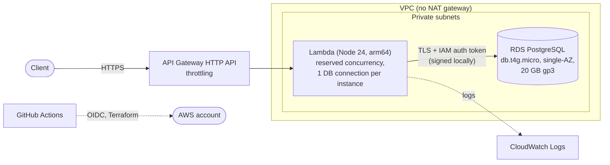

# ADR-002: AWS architecture and cost envelope

- **Status:** Proposed
- **Date:** 2026-10-03
- **Issue:** #13

## Context

CarCrashAPI is a read-mostly public REST API over US crash data, built as a portfolio project (roadmap: #2). Traffic is low and bursty, so the deciding forces are:

- **Idle cost.** Most of the time nobody calls the API. Anything billed per hour regardless of traffic dominates the bill.
- **Safe to expose publicly.** An unauthenticated endpoint needs an abuse guard and must not let a spike take down the database.
- **Infrastructure as code, no stored keys.** Everything is Terraform, and CI reaches AWS through GitHub OIDC (see `CLAUDE.md`).
- **Same app on Lambda and locally.** ADR-001 chose Hono, which runs under both a Node server and a Lambda adapter.
- **A relational store that the Go prototype's queries map onto.** This ADR decides the engine and hosting (RDS PostgreSQL). ADR-003 (#14) covers only the data source, license and scope.

## Options considered

### Option 1: API Gateway HTTP API → Lambda → RDS PostgreSQL (proposed)

- API Gateway HTTP API in front of one Lambda function (Node.js 24, arm64) running the Hono app.
- Lambda runs in private subnets, with RDS PostgreSQL (`db.t4g.micro`, single-AZ, 20 GB gp3) in the same subnets.
- **No NAT gateway.** Lambda authenticates to RDS with IAM database auth. The token is signed locally from the function's credentials, so no network call to AWS is needed. Connections use TLS with the RDS CA bundle. Lambda's own logging goes through the Lambda service, not through the function's network.
- **Connection protection.** Reserved concurrency caps simultaneous instances, and each instance holds one `pg` connection. The cap is set below the instance's `max_connections` (a `db.t4g.micro` has about 80 to 100), so a spike gets throttled with 429s instead of exhausting the database. RDS Proxy is not needed at this scale and costs about $22 per month on its own (billed at $0.015 per vCPU-hour with a 2-vCPU minimum).
- **Abuse guard.** API Gateway stage throttling (rate and burst limits), set well below the Lambda concurrency cap.
- Pros: per-request billing for everything except the database. No NAT gateway (about $33 per month) and no load balancer (about $16 per month). Small Terraform surface.
- Cons: the database is always on, so the floor is about $14 per month per environment. Lambda in a VPC adds cold-start time. A private database cannot be reached from GitHub-hosted CI runners, so migrations (#18) need their own route, decided below.

### Option 2: ECS Fargate + ALB

- A container service behind an Application Load Balancer, with RDS in private subnets.
- Pros: the conventional "container service" story. No Lambda cold starts, and long-lived pooled connections work naturally.
- Cons: the ALB (about $16 per month) and an always-on task (about $9 per month for the smallest size) bill with zero traffic. Private subnets need a NAT gateway or VPC endpoints for image pulls and logs, adding $7 to $33 per month. That is roughly $35 to $60 per month per environment before the database, which is more than double Option 1.

### Option 3: Aurora Serverless v2

Scales to zero ACUs only with auto-pause, and its resume time and minimum cost per environment are higher than a `db.t4g.micro`. Not worth it for a small, steady-size dataset. Revisit only if ADR-003 finds the database needs to scale.

## Decision

Proposed: adopt Option 1. Recommendations for the open questions in the issue:

- **Database: RDS PostgreSQL 17, `db.t4g.micro`, single-AZ, 20 GB gp3.** Version 17 matches `postgres:17` in `compose.yaml` and the CI service containers, so one major version runs everywhere (#52).
- **Migrations run from a second Lambda in the same subnets.** It is built from the same bundle and invoked by the deploy workflow before the API is updated (#39). CI never needs a network route to the database.
- **Region: `us-east-1`.** Lowest prices and the widest service availability. No latency or data-residency requirement argues for anything else.
- **Environments: `staging` and `prod`, in the same AWS account, with separate Terraform state.** Splitting into two accounts is cleaner but adds setup cost that this project does not need. Revisit it if the project grows.
- **Staging is created on demand and destroyed when idle.** A manual-dispatch GitHub workflow runs `terraform apply` or `destroy`, so staging costs nothing between uses. Staging data is reloaded from the import pipeline (epic #4) or a snapshot.
- **Budget: $25 per month in total, with an AWS Budgets alert at 80% of that amount.** Prod's expected cost is about $14 to $16 per month, which leaves room for staging.
- **Custom domain: not at first.** Use the default `execute-api` URL. Route 53 adds $0.50 per month for the hosted zone plus a domain registration of about $15 per year, and ACM certificates are free. Add it as a follow-up if the project wants a branded URL, and then replace the default URL in the README.

### Architecture

### Estimated monthly cost per environment

Estimates use `us-east-1` on-demand prices as of this writing and assume under 1 million requests per month. Check them against the AWS pricing pages before accepting.

| Item | Prod | Staging (always on) | Staging (destroyed when idle) |
| --- | --- | --- | --- |
| RDS `db.t4g.micro`, single-AZ (about $0.016 per hour) | $11.70 | $11.70 | $0 |
| RDS storage, 20 GB gp3 | $2.30 | $2.30 | $0 |
| RDS backups (free up to the size of the database) | $0 | $0 | $0 |
| API Gateway HTTP API (about $1 per million requests) | under $1 | under $1 | $0 |
| Lambda (inside the free tier at this volume) | $0 | $0 | $0 |
| CloudWatch Logs (short retention) | about $1 | about $0.50 | $0 |
| **Total** | **about $15 to $16** | **about $15** | **about $0** |

Idle staging costs nothing only because it is destroyed. A stopped RDS instance still bills for storage and restarts itself after 7 days, which is why destroy is preferred over stop.

## Consequences

- **Good:** the idle floor is the database alone, about $15 per month. There is no NAT gateway, load balancer or RDS Proxy. The connection cap and API throttling protect the database from spikes, and no database password is stored anywhere.
- **Bad:** the database is always on in prod. Reserved concurrency caps throughput, so a real spike returns 429s rather than scaling. Lambda inside a VPC adds some cold-start time. Single-AZ RDS has no automatic failover, so a zone outage means downtime until restore. That is acceptable for a portfolio API.
- **Follow-ups:**
  - Terraform for the network, RDS, Lambda and API Gateway (epic #7) and the OIDC deploy role.
  - #39 implements the migration Lambda described above, and #33 (the Lambda + API Gateway module) hosts it. ADR-003 (#14) then covers only the data source, license and scope.
  - Set the concrete throttle and reserved-concurrency numbers against RDS `max_connections` when the infrastructure is written, and add a Terraform check that the cap stays below it.
  - Create the AWS Budgets alert in Terraform.
  - Replace the proposal diagram in `README.md` with the one above once this ADR is accepted.
  - Revisit if sustained traffic makes Lambda costlier than a small container service, or if the connection cap throttles real users.
